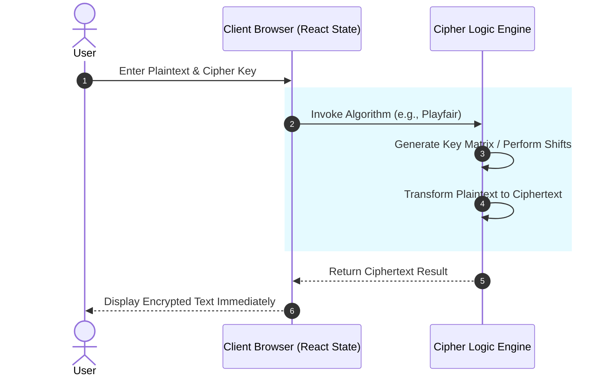

# 🧮 EnigmaClass
> **An Interactive, Real-Time Educational Sandbox for Classical and Modern Cryptography.**

🔥 [View Live Application](https://enigmaclassx.vercel.app/)


## Table of Contents
- [Project Philosophy](#project-philosophy)
- [Why EnigmaClass?](#why-enigmaclass)
- [Feature Comparison](#feature-comparison)
- [Architecture & Data Flow](#architecture--data-flow)
- [Supported Cryptographic Algorithms](#supported-cryptographic-algorithms)
- [Technology Stack](#technology-stack)
- [Project Structure](#project-structure)
- [Installation & Usage](#installation--usage)
- [Browser Compatibility](#browser-compatibility)
- [Frequently Asked Questions (FAQ)](#frequently-asked-questions-faq)
- [Roadmap](#roadmap)
- [License](#license)
- [Author](#author)

---

## Project Philosophy
Cryptography is often taught through dry mathematical formulas or command-line tools that obscure the actual mechanics of data transformation. EnigmaClass exists to bridge the gap between theoretical cryptography and practical understanding by providing a visually rich, interactive sandbox. 

By shifting cryptographic execution to the client's browser, EnigmaClass allows students, developers, and security enthusiasts to see exactly how ciphers manipulate text in real-time without needing complex backend setups.

## Why EnigmaClass?
Traditional learning methods for cryptography usually involve reading textbooks or running Python scripts. EnigmaClass flips this model:
- **Everything executes instantly in the browser.**
- **No backend servers are required.**
- **Immediate visual feedback on encryption/decryption steps.**
- **A unified dashboard for both historical and modern algorithms.**

By marrying a modern React UI with raw cryptographic algorithms, this system ensures that learning complex security concepts is accessible, engaging, and fast.

## Feature Comparison
| Feature | EnigmaClass | CLI Tools | Textbooks |
| :--- | :---: | :---: | :---: |
| **Real-Time Visual Execution** | ✅ | ❌ | ❌ |
| **Interactive UI/UX** | ✅ | ❌ | ❌ |
| **Zero Setup Required (Web)** | ✅ | ❌ | ✅ |
| **Historical & Modern Ciphers** | ✅ | ✅ | ✅ |
| **Client-Side Processing** | ✅ | ✅ | N/A |


## Architecture & Data Flow

### Real-Time Cipher Execution Flow
Data never leaves the browser. All transformations are purely mathematical functions executed locally.



## Supported Cryptographic Algorithms

EnigmaClass supports a comprehensive suite of algorithms ranging from ancient Roman ciphers to modern Public-Key infrastructure.

**Classical Ciphers**
- **Caesar Cipher:** Simple substitution cipher using alphabet shifts.
- **Vigenère Cipher:** Polyalphabetic substitution using a keyword.
- **Hill Cipher:** Polygraphic substitution based on linear algebra and matrices.
- **Rail Fence Cipher:** Transposition cipher using a zig-zag pattern.
- **Playfair Cipher:** Manual symmetric encryption using a 5x5 key matrix.

**Modern Cryptography**
- **RSA (Rivest–Shamir–Adleman):** Asymmetric public-key encryption utilizing prime number factorization.
- **Diffie-Hellman:** Key exchange protocol for establishing a shared secret over an insecure channel.
- **One-Time Pad (OTP):** The only mathematically unbreakable encryption technique, using a pre-shared random key.

## Technology Stack
**Frontend & UI**
- HTML5 / CSS3
- Tailwind CSS (Utility-first styling)
- React 19 / Vite
- React Router DOM (Client-side routing)
- Lucide React (Icons)
- Framer Motion (Animations)

**Core Logic**
- Vanilla JavaScript Math & String Manipulation
- Client-Side Cryptographic implementations

## Project Structure
```text
EnigmaClass
│
├── public/                # Static assets
├── src/
│   ├── components/        # UI Components (Sidebar, Header, Footer)
│   ├── pages/             # Cipher Route Pages (Caesar, RSA, etc.)
│   ├── App.jsx            # Main React Routing 
│   └── main.jsx           # React Entry
├── index.html           
├── tailwind.config.js     
├── vite.config.js       
└── README.md            
```

## Installation & Usage

**Quick Start (Local)**
Clone the repository:
```bash
git clone https://github.com/kirtanpatel2201/EnigmaClass.git
cd EnigmaClass
```
Install dependencies and run:
```bash
# Install all dependencies
npm install

# Start the local development server
npm run dev
```

## Browser Compatibility
EnigmaClass relies on standard JavaScript ES6+ features and runs smoothly on all modern browsers.

| Browser | Minimum Version | Supported |
| :--- | :---: | :---: |
| Google Chrome | 60+ | ✅ |
| Mozilla Firefox | 60+ | ✅ |
| Microsoft Edge | 79+ | ✅ |
| Safari | 12+ | ✅ |
| Brave | 1.0+ | ✅ |

## Frequently Asked Questions (FAQ)

**Does EnigmaClass store any of my data?**  
No. EnigmaClass is a purely client-side application. Any text you encrypt or decrypt is processed exclusively within your browser's memory and is never transmitted to a server.

**Are the modern algorithms (like RSA) safe for production use?**  
The implementations provided in EnigmaClass are designed for **educational purposes** to demonstrate the underlying mathematics. For production applications, always use established libraries like the native WebCrypto API or OpenSSL.

**Can I contribute a new cipher?**  
Absolutely! Feel free to fork the repository and submit a pull request with new algorithms.

## Roadmap
**Planned Features & Priorities**
- ✅ Core Classical Ciphers (Caesar, Vigenère)
- ✅ Advanced Classical Ciphers (Hill, Playfair)
- ✅ Modern Algorithms (RSA, Diffie-Hellman)
- 🔄 Step-by-Step Visualization Mode (Show the math in real-time)
- 🔄 AES & DES Educational implementations
- 🔄 Dark/Light Mode Toggle

## License
This project is licensed under the MIT License.

## Author
**Kirtan Patel**  
GitHub: [@kirtanpatel2201](https://github.com/kirtanpatel2201)
