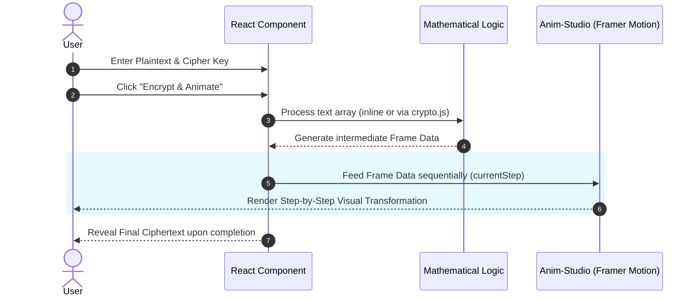

# 🧮 EnigmaClass
> **An Interactive, Real-Time Educational Sandbox for Classical and Modern Cryptography.**

🔥 [View Live Application](https://enigmaclassx.vercel.app/)


## Table of Contents
- [Project Philosophy](#project-philosophy)
- [Why EnigmaClass?](#why-enigmaclass)
- [Architecture & Data Flow](#architecture--data-flow)
- [Supported Cryptographic Algorithms](#supported-cryptographic-algorithms)
- [Technology Stack](#technology-stack)
- [Project Structure](#project-structure)
- [Installation & Usage](#installation--usage)
- [Frequently Asked Questions (FAQ)](#frequently-asked-questions-faq)
- [License](#license)
- [Author](#author)

---

## Project Philosophy
Cryptography is often taught through dry mathematical formulas or command-line tools that obscure the actual mechanics of data transformation. EnigmaClass exists to bridge the gap between theoretical cryptography and practical understanding by providing a visually rich, interactive sandbox. 

By shifting cryptographic execution entirely to the client's browser, EnigmaClass allows students, developers, and security enthusiasts to see exactly how ciphers manipulate text in real-time, step-by-step, without needing complex backend setups.

## Why EnigmaClass?
Traditional learning methods for cryptography usually involve reading textbooks or running Python scripts. EnigmaClass flips this model:
- **Interactive Classrooms (Anim-Studio):** Every single cipher features a step-by-step, auto-scrolling visual classroom built with Framer Motion to demonstrate the exact mathematical transformations happening under the hood.
- **Zero Backend Servers Required:** Everything executes instantly in the browser memory.
- **Step-by-Step Execution:** Users click to initiate the encryption process, which visually walks through the algorithm frame-by-frame before revealing the final output.

## Architecture & Data Flow

### Real-Time Cipher & Animation Flow
Data never leaves the browser. The system separates raw cryptographic logic (`crypto.js`) from visual state management inside the React components.



## Supported Cryptographic Algorithms

**Classical Ciphers**
- **Caesar Cipher:** Simple substitution cipher using alphabet shifts (Modulo 26).
- **Vigenère Cipher:** Polyalphabetic substitution using a repeating keyword.
- **Hill Cipher:** Polygraphic substitution utilizing linear algebra and matrix inversion.
- **Rail Fence Cipher:** Transposition cipher using a zig-zag grid pattern.
- **Playfair Cipher:** Manual symmetric encryption using a 5x5 key matrix.

**Modern Cryptography**
- **AES (Advanced Encryption Standard):** The current global standard for symmetric encryption, visualized step-by-step through SubBytes, ShiftRows, MixColumns, and AddRoundKey matrix operations.
- **DES (Data Encryption Standard):** Historic symmetric-key algorithm based on the Feistel Network, featuring animated S-Box substitutions and P-Box permutations.
- **RSA (Rivest–Shamir–Adleman):** Asymmetric public-key encryption utilizing prime number generation and modular exponentiation.
- **Diffie-Hellman:** Key exchange protocol for establishing a shared secret over an insecure channel, featuring two-way visual network traffic.
- **One-Time Pad (OTP):** Mathematically unbreakable symmetric encryption using a pre-shared random key.

## Technology Stack
**Frontend & UI**
- React 19
- Vite 8
- Tailwind CSS 4.3 (Utility-first styling)
- Framer Motion 12.4 (Complex UI Animations & Step transitions)
- Lucide React (Iconography)
- React Router DOM 7 (Client-side routing)

**Core Logic & Tooling**
- Vanilla JavaScript Math (Shared between inline component logic and `src/lib/crypto.js`)
- Oxlint (High-performance JavaScript linter)

## Project Structure
```text
EnigmaClass
│
├── public/                # Static assets (Favicons, etc.)
├── src/
│   ├── components/        # Shared UI Components (Sidebar, Header, Footer)
│   ├── lib/               # crypto.js (Raw mathematical cipher algorithms)
│   ├── pages/             # Cipher Route Pages (CaesarCipher.jsx, RsaCipher.jsx, etc.)
│   ├── App.jsx            # Main React Router configuration
│   ├── index.css          # Global CSS and structural styles (.anim-studio, etc.)
│   └── main.jsx           # React Entry Point
├── index.html           
├── package.json     
├── vite.config.js       
└── README.md            
```

## Installation & Usage

**Quick Start (Local)**
Clone the repository:
```bash
git clone https://github.com/kirtanpatel2201/EnigmaClass.git
cd EnigmaClass
```
Install dependencies and run:
```bash
# Install all dependencies
npm install

# Start the Vite local development server
npm run dev
```

## Frequently Asked Questions (FAQ)

**Does EnigmaClass store any of my data?**  
No. EnigmaClass is a purely client-side application. Any text you encrypt or decrypt is processed exclusively within your browser's memory and is never transmitted to a server.

**Are the modern algorithms (like RSA) safe for production use?**  
The implementations provided in EnigmaClass are designed strictly for **educational purposes** to visually demonstrate the underlying mathematics. For production applications, always use established libraries like the native WebCrypto API or OpenSSL.

## License
This project is licensed under the MIT License.

## Author
**Kirtan Patel**  
GitHub: [@kirtanpatel2201](https://github.com/kirtanpatel2201)
